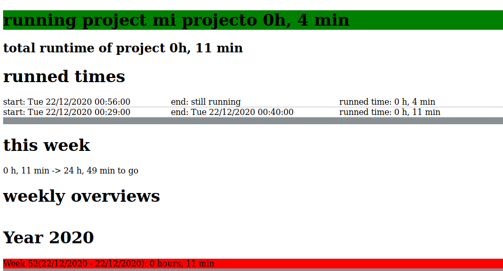

# simpletimetracker

a simple timetracking device for mate-desktop and alike which works with a simple icon in the icon-tray and uses html with javascript to show overviews over tracked time

## what is simpletimetracker?

i was in need of a simple timetracking tool for the mate-desktop.
as the old program i used (gnotime) did not want to run anymore because it is abandoned and had run out of some dependencies i looked for a replacement and could not find anything that works as simple as i wanted it to be:
just an icon in the icon-tray which activates on a click.

so timetracker is essentialy that: just a small python-skript which adds an icon to your icon-tray and whenever you click
start/stop on the timetracker it starts or stops tracking time by simply putting a starttime and an endtime to a textfile.
this textfile is then used in an html-page with javascript to calculate all the information out of it.

## what i use it for
basicaly what i need is to have overview over the time i am working per week as i am working homeoffice and
want to keep track of my workload. so this simple program does exactly that. it measures the time and then
tells me how much i worked this week and if i have to work on and gives me an overview per week.
of course it can be simply altered to do some other calculations, as all this stuff happens in a small html-file
with a small javascript-part to sort it out.

after using it only for myself i decided why not give it back to the community. sure, its only a small tool but
maybe there are other people who are looking for a simple script like that.
and the alternatives i found in the repositories do not fit my needs as they all tend to have other usecases or
have a complicated gui which stands just in the way of what i want - a tray-icon which shows if its running or not. nothing more.

## how can you alter it?

i made some changes so its more "open to the world" and not specific anymore on where i put it and such.
so to configure simpletimetracker just open the file "config.js" - its a commented example of a working timetracker.
there you can:
1. alter the name of your project (which effectively changes the project too)
2. alter the standard-language you use (supported are english and spanish)
3. alter scheduled Time per Week (in hours)

## how it works


the script runs and adds start- and end-times to the textarchive with the ending '.js' (for example myproject.js) - so please do not call it "config" ;)
(even though it still should work fine, it just blows up your config.js)


you can open the overview from the app and it opens "timetracker.html" in your standard navigator. there a javascript does its magic and presents you an overview.

you can also open a small dialog from within the app to see how many hours and minutes it has tracked since last start of the application - which is quite usefull as you do not always want to open the whole overview to find out how long you have been working right now.


## what if i want more then one project?

as i never needed it and find it kind of bothersome to track different things within the same gui (like in which project am i still tracking?)
i decided to not implement it (yet).
but of course its possible by just copying the whole directory to another directory and run the second instance from there (and changing the icons for example so that its obvious in which you are tracking in the icon-tray). as timetracker is very small (less than 50kb) it shouldnt matter at all.
or - if you dont run both at the same time - you could copy launch.sh to launch2.sh and config.js to config1.js and config2.js and then alter both launch.sh that before starting the python-app you would copy the config1.js (or config2.js in launch2.sh) over the config.js so it starts with the right config.
just a thought.

## can i alter the tracked times?

yes of course. they are stored in a simple and humanly understandable format in a text-archive. just open the database in a texteditor (shortcut in menu now) and alter the dates you wand to alter (newest start-end-dates at end of file).
the entrys look like this:
```
addStartTime('2020-12-19T15:56');
addEndTime('2020-12-19T16:58');
```
so year-month-day and then after a T comes hours:minutes.

## i forgot to end the tracked times before shutting down my computer

just open the textfile and add an endtime with the time you remember to shut down your computer.
```
addEndTime('2020-12-19T16:58');
```

## how to install?
if you have installed the repository of raboms then you can just install it with your package-manager
(apt-get install simpletimetracker)

alternatively you can install it via git
```
git clone https://github.com/gaenseklein/simpletimetracker
```
and make a shortcut to launch.sh or just directly a shortcut with
'python path/to/simpletimetracker/timetrackerapp.py'

thats it. if you have suggestions or need some improvements feel free to open a new issue and ask nicely :)
